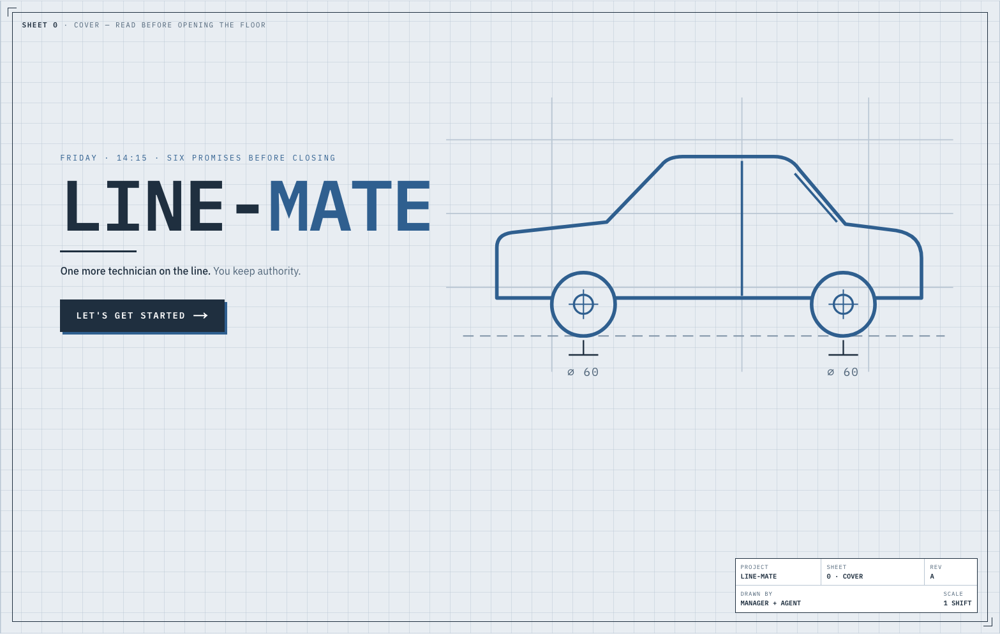

<p align="center">
  <a href="https://line-mate.vercel.app"></a>
</p>

**Line-Mate is one more technician on the line: a digital twin of a repair shop in a browser tab, where an agent works the floor through WebMCP and the manager keeps authority.**

🚗 **Web app:** https://line-mate.vercel.app
🎬 **Demo video:** https://www.youtube.com/watch?v=SHw8O6rTDx8

## What Line-Mate is

Line-Mate is a live model of a mid-market auto repair shop — three bays, a diagnostics station, three technicians, twelve cars and six promises by COB. By simulating the shop's floor, it helps the manager make a decision upon real-data considering multiple scenarios and understanding the trade-off between one and another.

What makes it WebMCP-native rather than "AI added to a simulator": there is one world and one command boundary. A click, a drag and an agent tool call all run the same command, stamped with its actor (`human`, `agent`, `simulation`), so every change on the board is attributed, the baseline is protected behind scenario branches, and the agent's context arrives through the tools themselves — no system prompt, no scraped DOM, no second backend.

## WebMCP tools

| Tool | What it is for |
|---|---|
| `inspect_system` | The whole picture: shift clock, constraints, bays and technicians, jobs with their promises, latest KPIs, recent changes. Carries the agent's briefing and, during a proposal, the on-screen draft with per-change authorship. Use it first. |
| `inspect_resource` | One bay or station: status and blocking reason, routed jobs, utilization, queue, who can work there. |
| `inspect_work_item` | One vehicle's job: promise, priority, steps and the skills they need, current route, feasibility versus the promise. |
| `get_simulation_results` | Structured results of a scenario's last run: promises met, completions, revenue and cost, utilization, late and unfinished jobs, bottleneck. |
| `compare_scenarios` | Aligned KPIs for 2–4 scenarios with deltas against the first and a one-line verdict. |
| `create_scenario` | Clone a scenario into a named experiment and make it active — the move that keeps the baseline intact. |
| `update_resource` | Validated partial update of a bay or station (status, blocking, capacity, availability, cost). |
| `update_work_item` | Change a job's priority. Promises, steps and revenue are the customer's facts and cannot be edited. |
| `route_work_item` | Send a job to a bay or station at a queue position, or release its pin. While a proposal is on screen it edits the visible draft instead — attributed to the agent, nothing applied until the manager says so. |
| `apply_plan` | Apply a whole plan — the one `explore_schedules` returned or the manager's edited version — as one attributed change. |
| `post_shift_note` | Record the shift note in the shop log with its channels (slack, email, sms). No external delivery, no network request. |
| `run_simulation` | Run the deterministic shift simulation for a scenario and persist the result. Same input, same numbers. |
| `explore_schedules` | Search a bounded set of alternative schedules and score each across seeded replications — returns the best plan and up to eight runners-up with measured keep-rates. The screen animates the real search. |

Three commands are deliberately **not** exposed to agents — `inject_event` (the part delay), `activate_scenario` (which scenario the screen shows) and `reset_demo` — they are the manager's controls (`Shift+E`, the Board/Floor switch, `Shift+0`).

### The format every tool obeys

Each tool is a command from the app's single registry, registered through the WebMCP imperative API with `name`, `description`, `inputSchema` (JSON Schema generated from the command's zod schema) and an async `execute`, plus `title` and `annotations.readOnlyHint`:

```ts
// src/webmcp/adapter.ts — feature-detected, torn down with an AbortController
await document.modelContext.registerTool(
  { name, title, description, inputSchema, annotations, execute },
  { signal },
);
```

A tool descriptor as the agent sees it:

```json
{
  "name": "route_work_item",
  "title": "Route work item",
  "description": "Send a job to a specific bay or station, optionally at a queue position (1 = next) …",
  "inputSchema": {
    "type": "object",
    "properties": {
      "workItemId": { "type": "string" },
      "resourceId": { "type": ["string", "null"] },
      "position": { "type": ["integer", "null"], "minimum": 1, "maximum": 20 },
      "scenarioId": { "type": "string" }
    },
    "required": ["workItemId", "resourceId"]
  },
  "annotations": { "readOnlyHint": false }
}
```

And a real call from a recorded live session — the agent moving the black wagon inside the manager's proposal:

```jsonc
// call
route_work_item({ "scenarioId": "SCN-BASELINE", "workItemId": "veh-05", "resourceId": "bay-2" })
// result
{
  "draftEdited": true,
  "workItemId": "veh-05",
  "route": { "resourceId": "bay-2", "position": 1 },
  "summary": "Updated the proposed-plan draft on the manager's screen. Nothing is applied to the world until the manager presses Apply & notify team."
}
```

Every mutation returns a `changeId`, the actor and a before/after summary; responses are JSON-safe and bounded (the exploration's animation trace, for instance, is stripped unless the caller asks for it).

## Project structure

```text
line-mate/
├─ src/
│  ├─ app/            Next.js App Router: layout (metadata, fonts), page, tab icon, cover image
│  ├─ domain/         Canonical serializable types, zod schemas, fixtures, disruptions, demo beats
│  ├─ simulation/     Deterministic discrete-event engine + seeded schedule exploration (no React)
│  ├─ commands/       The one command boundary: registry, validation, actor attribution, agent briefing
│  ├─ store/          The single live world (Zustand) + story/view state, shift clock, draft
│  ├─ webmcp/         document.modelContext adapter: feature detection, tool descriptors, cleanup
│  └─ components/
│     ├─ frame/       Shell, cover (SHEET 0), header, strips, title block, inspector, clock ticker
│     ├─ board/       Shift board: promise strip, station cards, lanes, drag & drop, progress
│     ├─ floor/       Isometric shop: 2.5D SVG projection, lifts, lot, routes, drag to lift
│     ├─ story/       Exploration panel, proposal card, resolved card, demo keyboard controls
│     └─ vehicles/    Side-view vehicle glyphs by body kind
├─ docs/              Architecture, simulation model, WebMCP tool contract, design system, demo scenario
├─ public/            cover.png (also the social preview)
└─ package.json       npm run dev · npm run verify (typecheck + lint + tests + build)
```

Every `src/` subdirectory carries its own README.

## Try it in two minutes

1. Open **https://line-mate.vercel.app** in the ChatGPT desktop app's in-app browser, or in Chrome 149+ with `chrome://flags/#enable-webmcp-testing` enabled (restart Chrome).
2. **Let's get started** (or `Enter`). The header pill reads **`Agent linked · 13 tools`**.
3. `Shift+E` — the part delay lands: Bay 3 blocked, 4/6 at risk.
4. Ask the agent: *"Take a look at the shop and tell me what's wrong."* Then: *"Now run the schedules and keep all six — no overtime, no extra techs."* Watch the search animate, the proposal land with attributed cards, and the recovery reach **6/6**. Drag a card or change its bay yourself, then ask what changed.
5. No agent handy? Chrome DevTools' **WebMCP panel** lists the 13 tools and invokes them directly. Nothing to install, no login.

Views: `Board | Floor` in the header. Demo keys: `Shift+E` delay · `Shift+R` explore & propose · `Shift+A` apply & notify · `Shift+0` reset.

## Dev stack

Next.js (App Router) · React · TypeScript · Tailwind · Zustand · Motion · zod · Vercel. Built by Mario Aderman for the 2026 WebMCP Challenge with Claude Code and Codex
